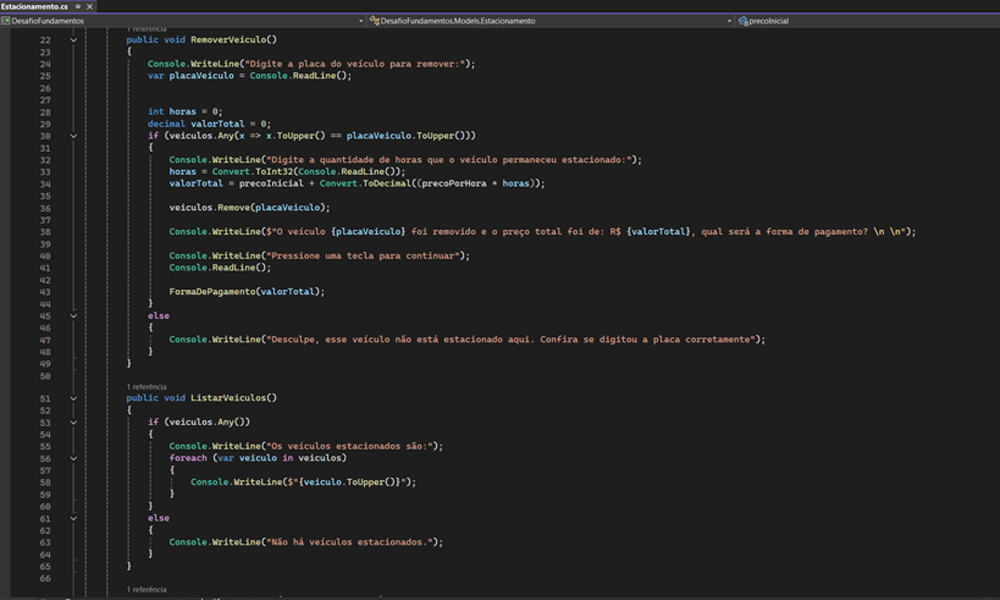

# Desafio - DIO
www.dio.me

## Desafio de projeto
O desafio do projeto consiste em colocar em prática os fundamentos do .NET;

## 🚀 Tecnologias
Esse projeto foi desenvolvido com as seguintes tecnologias:

- CSharp (C#) / .NET
- Git e Github

## Contexto
Foi dada a porposta de construir um sistema para gestão de estacionamento, conseguindo assim gerenciar a quantidade de veículos estacionados e suas respectivas placas, como também adicionar e remover. Acrescentei um método de pagamento, assim analisando a forma de pagamento e em caso de dinheiro, mostrar o valor do troco na tela! Como diriam muitos, o básico que funciona, voltando a consolidar a base em CSharp e .NET.

## Proposta
Esse é o diagrama disponibilizado pela Dio, para fazer uma classe chamada "Estacionamento";

A classe contém três métodos, sendo um método para cada respectivo item do menu:
1. Cadastrar veículo
2. Remover veículo
3. Listar veículos
4. Encerrar

**--------------------------------------------------------------------------------------------------------------------------------------**

**FormaDePagamento** Esse método foi feito a mais, por mim, para colocar em prática meus conhecimentos. Ao chamar a função **RemoverVeiculo**, a nova função é chamada, passando como parâmetro o valor total representado pela soma de precoInicial + (precoPorHora * quantidadeDeHoras).

Logo, é feito um menu interativo com as opções:
1. Pix
2. Dinheiro
3. Encerrar

Quando o cliente seleciona **Pix**, é gerado uma NewGuid como chave aleatória. Quando selecionado Dinheiro, verifica se o valorRecebido é maior que o valorTotal, se sim, apresenta o quantia que deverá ser devolvida como troco e tratado para que o resultado da soma não apareça como negativo na tela.

## Exemplo de Código.
Aqui está um exemplo de um pouco do código desse desafio.

## Solução
O código está sendo trabalhado, estou desenvolvendo agora mais classes para conseguir tirar algumas responsabilidades de dentro da mesma classe e deixa-lá mais abstrata.

## Dio.me
Para acessar o README - Dio-md responsável pelo desavio, segue o link:
[https://github.com/WilliamMoro/DOTNET-fundamentos-desafio/edit/main/README-Dio.md](https://github.com/WilliamMoro/DOTNET-fundamentos-desafio/blob/main/README%20-%20Dio.md)

## Contate-me:
 :wave: [Contato pelo discord](https://discord.gg/williammoro) ou [LinkedIn](www.linkedin.com/in/william-moro-3b4909184)
